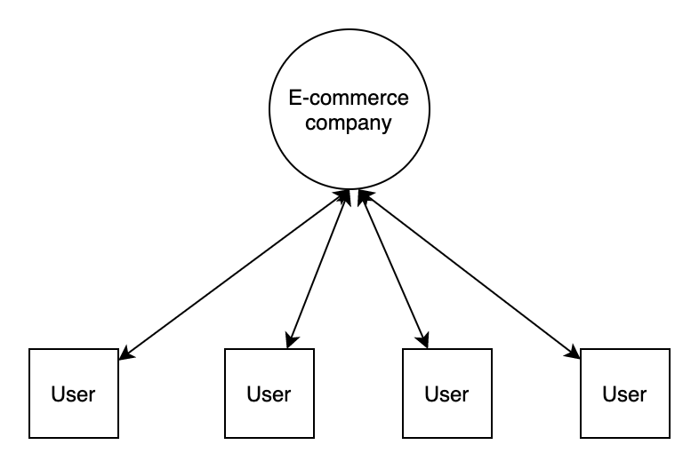
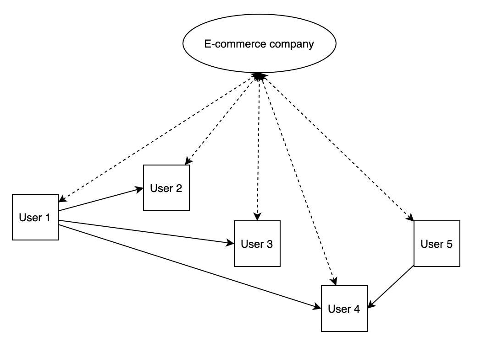

# Chip - Social Network Modeling Analytics

## Introduction

Analytics tools enable e-commerce companies and website owners to identify how users interact with their web content. These relationships are usually connecting one user with one website.

A graph of the typical model might look something like this:

These systems undoubtedly provide valuable information, but they fail to represent how content is shared and connected between end users.

People are now more connected than ever. They are also now more empowered than ever to leverage those connections to share content and ideas with each other. This presents a large opportunity for companies to leverage these networks to increase enagement with their content. The first step in the process of leveraging these networks involves modeling how your users share content on your website.

This is where Chip comes into play. Chip provides an automated approach for modeling how users engage with and share content on your website, automatically building connected graphs for your user base.

A graph of the connected model might look something like this:

Based off this model we can assume that User 1 is well connected and that people in User 1's network are inclined to show interest in the things that User 1 shares. User 1 could be a social influencer for our brand, so we will offer User 1 a 30% off discount on 2 products.
